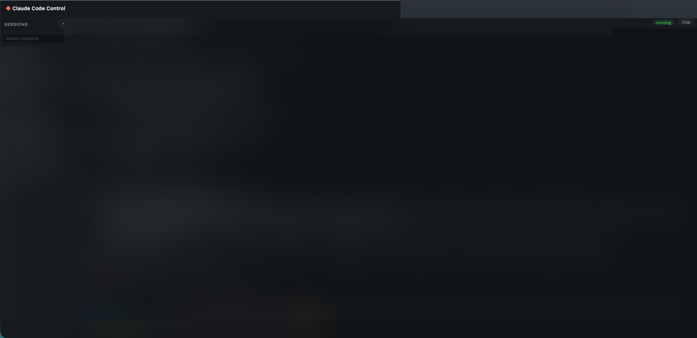

# Claude Code Control

A local web UI for managing multiple [Claude Code](https://claude.ai/code) CLI sessions from a single browser tab.

Run several Claude agents across different projects simultaneously, send prompts, track token usage, and review conversation history — all without juggling terminal windows.



> **Note:** Add a screenshot at `docs/screenshot.png` before publishing.

---

## Features

- **Multiple sessions** — spawn and manage Claude Code processes across different project directories, each in its own terminal
- **Session persistence** — sessions survive server restarts and are restored as "exited" with their last terminal output intact
- **Slash command toolbar** — one-click shortcuts for `/compact`, `/clear`, `/model`, `/ultraplan`
- **Prompt bar** — send prompts directly without clicking into the terminal; includes quick-prompt snippets
- **Conversation viewer** — browse the full chat history from Claude's JSONL logs in a side panel with collapsible tool calls
- **Token usage** — per-session and global token counts refreshed every 10 seconds
- **Session discovery** — automatically detects running `claude` processes not managed by the app and lets you import them
- **Session history** — resume any past Claude session by UUID from the new session modal
- **Auto-restart** — toggle per-session to automatically respawn Claude with `--continue` when it exits
- **Native folder picker** — macOS folder dialog for selecting project directories

---

## Requirements

- **macOS** (Linux support is partial — native folder picker and process discovery use macOS-specific tools)
- **Node.js** v18 or later
- **Claude Code CLI** installed and authenticated (`claude` available in your PATH)

---

## Installation

```bash
git clone https://github.com/your-org/claude-code-control.git
cd claude-code-control
npm install
```

On macOS, `npm install` automatically fixes a known permission issue with the `node-pty` spawn helper binary. If you ever see a `posix_spawnp failed` error, run:

```bash
chmod +x node_modules/node-pty/prebuilds/darwin-arm64/spawn-helper
```

---

## Usage

```bash
npm start
```

Then open [http://localhost:3000](http://localhost:3000) in your browser.

### Creating a session

1. Click **+ New** in the sidebar
2. Pick a project directory using the **📁** button or type the path manually
3. Past sessions for that directory load automatically — click one to resume, or click **Create Session** to start fresh

### Managing sessions

| Action | How |
|--------|-----|
| Switch session | Click session in sidebar, or **Cmd+1**–**9** |
| New session | **Cmd+N** |
| Stop (keep history) | **×** on a running session |
| Remove entirely | **×** on an exited session |
| Restart | **↻** on an exited session |
| Auto-restart | **↺** toggle — respawns with `--continue` on exit |
| Send a prompt | Type in the prompt bar and press **Enter** |
| View chat history | **Chat** button in the terminal header |

### Session data

Token usage and conversation history are read directly from Claude Code's local JSONL logs at `~/.claude/projects/`. No data is sent anywhere — everything stays on your machine.

App session state is stored at `~/.claude-code-control/sessions.json`.

---

## Architecture

```
claude-code-control/
├── server/
│   ├── index.js          # Express + WebSocket server
│   ├── api.js            # REST endpoints
│   ├── pty-manager.js    # node-pty process lifecycle
│   └── session-store.js  # In-memory store with JSON persistence
└── client/
    ├── index.html        # UI + all CSS (no build step)
    ├── app.js            # Session list, stats, modal, conversation viewer
    └── terminal.js       # xterm.js terminal + WebSocket relay
```

**Key design decisions:**

- **node-pty** spawns each `claude` process in a real pseudo-terminal so interactive prompts, colors, and keyboard input all work correctly
- **WebSocket relay** — the server bridges PTY output to the browser and keyboard input back to the PTY
- **xterm.js** (loaded from CDN) renders full VT100-compatible terminals in the browser
- **No build step** — the client is plain HTML/CSS/JS served statically; no bundler required
- **JSONL parsing** — token stats and conversation history are read server-side from Claude Code's own log files; no separate database

---

## Docker

A Dockerfile is included for running the server in a container. Note that Claude Code requires authentication, so you'll need to mount your `~/.claude` directory:

```bash
docker build -t claude-code-control .
docker run -p 3000:3000 \
  -v ~/.claude:/root/.claude \
  -v ~/.claude-code-control:/root/.claude-code-control \
  claude-code-control
```

> The native macOS folder picker (`osascript`) does not work inside Docker. Type project paths manually or pre-configure them.

---

## Contributing

Contributions are welcome. Please open an issue before submitting a pull request for significant changes.

**Running locally for development:**

```bash
npm start
# Edit client/ files — changes are served immediately (no reload needed for CSS/JS)
# Edit server/ files — restart the server to pick up changes
```

There is no test suite yet. Adding one is a good first contribution.

**Planned features** (tracked in issues):
- Dollar cost display per session
- Keyboard shortcuts (Cmd+N/W/K/1–9)
- Git branch badge in terminal header
- Session search/filter in sidebar

---

## License

MIT
